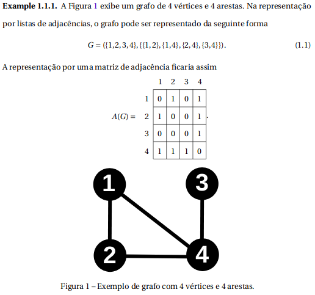

# Revisão para a P2 - Grafos, Buscas, Algoritmos Gulosos, Programação Dinâmica.
Revisão para a avaliação da segunda parte da disciplina.

## Grafos
### Definições
- __Vértices/Vertex(V)__: Representam elementos/unidades/entidades.
    - __n__ = `|V|` número de vértices.
- __Arestas/Edges(E)__: Representam ligações/conexões entre vertices.
    - __m__ = `|E|` número de arestas. 
- Um grafo pode possuir até `(n²-n)/2` arestas.
- Um grafo pode ser valorado/ponderado, ou seja, um valor/peso/custo é associado a cada aresta.
- Um grafo pode ser um grafo com sinais, exemplo: Amizade e inimizade, associado um valor 1 para amizade e -1 para inimizade. Note que: isso não representa um grafo valorado.
- Um grafo pode ser orientado, neste caso não se utiliza a definição e de arestas e sim de **arcos**.
- __Hipergrafo__: é um grafo no qual as arestas podem conectar qualquernúmero de vértices.
- __Multigrafo__:  um grafo que permite múltiplas arestas para o mesmo par devértices. Logo, não se tem mais um conjunto de arestas, mas sim uma tupla de arestas.
- __Grau de um vértice__: O grau de um vértice é a quantidade de arestas que se conectam a determinado vértice. Denotado por: d(v) onde v ∈ V. Ainda pode ser utilizado o símbolo **+** para arestas saintes e **-** para arestas entrantes.
- __Isomorfismo/Igualdade__: se existe uma função bijetora (uma-por-uma) para todo v ∈ V1 e u ∈ V2 preservando as relações de adjacência.
- __Partição de grafos__: diga-se k-partido se para determinado conjunto de vertice só pode ser acessado através de uma unica aresta. ??? (confirmar)
- __Matriz de incidência__: mapeia a origem e destino sobre um grafo, Dado um arco (u,v), b(u,(u,v))=+1 e b(v,(u,v)) = −1.

### Representações
- __Lista de adjacência__: Popular em Pappers, o grafo é representado por uma tupla. Exemplo: __`G = (V,E)`__ e __`G = (V,E,w)`__ para grafos valorados.
- __Matriz binária/adjacência__: Normalmente representado por **A(G)**, tal que é definida por `A(G) = {0,1}^(|V|x|V|)`. O elemento a(u,v) = 1 se existir uma aresta entre os dois vértices u e v. No caso de grafos valorados a(u,v) = valorAresta.
- Example:
 

### Operações
- Operações binárias:
    - União: Dados os grafosG1=(V1,E1) eG2=(V2,E2),G1∪G2=(V1∪V2,E1∪E2);
    - Soma (oujoin): Dados os grafosG1=(V1,E1) e G2=(V2,E2), G1+G2=(V1∪V2,E1∪E2∪{{u,v} :u∈V1∧v∈V2});
    - Produto cartesiano: Dados os grafosG1=(V1,E1) eG2=(V2,E2),G1×G2=(V1×V2,E), ondeE={{(v,w),(x,y)}: (v=x∧{w,y}∈E2)∨(w=y∧{x,y}∈E1)}.G1×G2eG2×G1são isomorfos;
    - Composição ou produto lexicográfico: Dados os grafos G1 = (V1,E1) e G2=(V2,E2), G1 ◦ G2 = (V1×V2, E), onde E={{(v,w), (x,y)} : ({v,x} ∈ E1 ∨ v = x)∧{w,y}∈E2};
    - Soma de arestas: Dados os grafos G1=(V1,E1) e G2=(V2,E2), os quais V1=V2, G1 ⊕ G2 = (V1, E1 ∪ E2)
- Operações unárias:
    - Contração de dois vértices: Dado um grafoG=(V,E) e dois vérticesu,v∈V, aoperação de contração desses dois vértices emG, gera um grafoG′=(V′,E′) o qualV′=V\{u,v}∪{u v} eE′={{x,y}∈E:x6=u∧x6=v}∪{{x,u v} : {x,u}, {x,v}∈E}

## Using Git
- `git init` Create a new repository
- `git add {. , filename} (--all)` Add files or specify file
- `git status` Check repository status
- `git commit -m "message"` Commit with message
  - Options:  
    - `-a` the same as add files to staged and commit  
    - `--amend` agregate to last commit
- `git checkout (hashlog) (--) filename` Get previous file version
  - Options:
    - `hashlog` Determine specify previous version
    - `--` Grab the file and put on stage 
- `git checkout hashlog` Get full previous version
- `git reset HEAD filename` Ignore staged files get file from repository
- `git reset haslog`
  - Options:  
    - `--soft` Moves the HEAD pointer to specify hashlog, dosen't change anything
    - `--mixed` Moves the HEAD pointer to specify hashlog and change the stage index to the same as the repository
    - `--hard` Moves the HEAD pointer to specify hashlog and change all to the same as the repository
- `git rm filename` Same as deleted file and add to stage
- `git mv filename` Same as rename file and add to stage + remove the oldname
- `git log` Shows staged loggs
  - Options:  
    - `-n 2` Limit results
    - `--since=2019-12-04` or `--until=2019-12-04` to filter by date also `--since="2 weeks ago"` or `--until=3.days`
    - `--author="name"` To filter by name
    - `--grep="reg"` To filter by regular expression
    - `--oneline` Every line it's a commit
    - `hash..hash` Specify a range commit
    - `filename` Eg. logs that afected that file
    - `-p` Shows what changed in that commit
    - `--stat --summary` Give a stats and summary about what changed
    - `--graph`Shows a graph, usefull with branchs. Good combination: `--oneline --graph --all --decorete`
- `git show hash` Shows the diff about some commit
- `git diff` Show the difference between working dir and staged
  - Options:  
    - `--staged` Show difference between staged and repository
    - `--color-words` Instead showing separate lines shows only colored words that changed
    - `-b` or `--ignore-space-change` Ignore one space change
    - `-w`or `--ignore-all-space` Ignore any space change (one or more)
    - `hashlog (filename)` Difference between working dir and some commit also can specify a file to check difference
    - `hash..hash filename` Difference between two differents commits about a file.
- `git revert hashlog` Revert a commit: what was deleted come back, what was add will be removed
- `git clean -f/n` Clean all untracked files, flag `n` means test run, `f` force delete

## Working with branchs
- `git checkout branch` Change between branchs
  - Options: 
    - `-b` Create and change to the new branch
- `git branch` Show branchs
  - Options: 
    - `-r` Show remote branchs
    - `-a` Show all branchs
    - `name` Create new branch
    - `name hashlog` Create new branch from a commit
    - `-m before after` Change branch name
    - `-d branchname` (Safe) Delete a branch that I didn't commit anything
    - `-D branchname` Force delete a branch even I commited anything and not merged

- `git merge branchname` Merge actual branch with branchname
- `git merge --abort` Merge abort after merge problemns
- `git checkout -b branchremote branchlocal` Get a specify branch from a remote project
- `git clone -b branch url` Get a specify branch from remote
- `git stash` Stash the last commit
  - Options: 
    - `save "message"` Save a staged status
    - `show -p stash@{n}` Show difference between branch and stash
    - `list` Show stash list
    - `pop` Apply stash and remove from stash list
    - `drop stash@{n}` Remove from stash
    - `apply (stash@{n})` Apply a stash and keep in stash list
    - `clear` Remove all stash

## Ignoring Files 
Create a file `project/.gitignore` and put in that file what you want ignore. Example: assets, images, temporary files. You also can use regular expressions in that file, such __*__ and **[0-9]**.

- `filename.ext` Ignore just a file
- `*.zip` Ignore zip files
- `path/` Ignore entire path
- `assets/videos/ocean[0-9].mp4` Ignore all files named ocean plus a number

You also can define a global __.gitignore__, just do `git config --global core.excludesfile .gitignore_global`

### What I should ignore?
Generally, compiled source code, packages, compressed files, logs and databases, OS generated files, user-upload assets. You can also check at [GitHub - Ignoring Files](https://help.github.com/articles/ignoring-files/ "Ignoring Files")

### Can I have same templates?
Yes, you can check at [GitHub - GitIgnore](https://github.com/github/gitignore "A collection of useful .gitignore") you will probably found anything you needed.

### I accidently add some file to stage index, but I don't want to track and also don't want delete that file?
You can remove that file using the `git rm --cached filename` to remove from stage index and keep in you directory.

### TRICK: I need keep a empty directory.
Usually you create a empty file called **.gitkeep** to keep this directory tracked by Git.

## Working with GitHub
1. Setup a account on Github
1. Create a Repo
1. On command line `git remote add <alias/origin> https://github.com/user/repo.git`
1. Push to Github`git push -u origin branchlocal`

To sync the remote repository to local
- `git fetch <alias/origin>`

Later you should merge the remote branch with you local branch
- `git merge origin/master`

When you was comfortable using these commands, try use `git pull` that means the same as git fetch + git merge

You also may need delete a remote branch, so `git push origin --delete branch`

## Workaround to get full repository with all branchs
1. `mkdir path; cd path`
1. `git clone --mirror repository.git .git`
1. `git config --bool core.bare false`
1. `git reset --hard`
